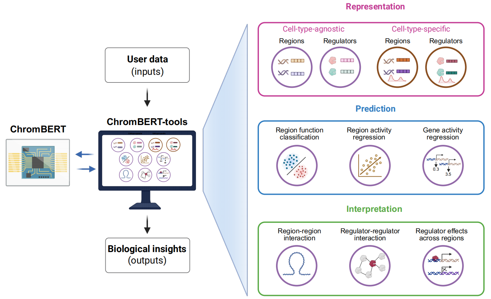

# ChromBERT-tools: A versatile toolkit for context-specific regulatory representations of transcription regulators across different cell types

> **ChromBERT** is a pre-trained foundation model designed to capture genome-wide co-association patterns of ~1,000 transcription regulators and to learn context-specific transcriptional regulatory networks (TRNs) [ChromBERT](https://github.com/TongjiZhanglab/ChromBERT).  

> **ChromBERT-tools** is a lightweight toolkit built upon ChromBERT that operationalizes context-specific regulatory representations for user data through modular command-line interfaces and Python APIs organized into three functional layers: representation generation, predictive modeling, and regulatory interpretation.



---

## 1. Installation

ChromBERT-tools is implemented in Python and requires Python 3.9 or above. It uses FlashAttention 2 for efficient model computation.
We provide two installation options.

### Option 1: Install with an Apptainer image (recommended)
```bash
# Install Apptainer.
conda install -c conda-forge apptainer
# Pull the official image.
apptainer pull chrombert-tools.sif oras://docker.io/chenqianqian515/chrombert-tools:20260505
# Check installation.
apptainer exec /path/to/chrombert-tools.sif chrombert-tools -h
```
Optional: If `apptainer pull` fails, download the image from the Google Drive link instead: [chrombert-tools](https://drive.google.com/file/d/14I-BQxrBNPwdZn-TKaG0Z8lpNiJlUd1f/view?usp=drive_link)

#### Optional: Update the Apptainer image
If you need to add new packages or update existing ones, edit edit_image.def and rebuild the image.
Here we update ChromBERT-tools as an example:
```bash
git clone https://github.com/TongjiZhanglab/ChromBERT-tools.git
cd ChromBERT-tools
apptainer build <new_image_name>.sif edit_image.def
```

### Option 2: Install from source
```bash
# Create and activate a conda environment.
conda create -n ChromBERT python=3.9 -y
conda activate ChromBERT
# Install PyTorch (< 2.4) with a CUDA version compatible with your system.
# Example for CUDA 12.1:
pip install torch==2.2.2 torchvision==0.17.2 torchaudio==2.2.2 --index-url https://download.pytorch.org/whl/cu121
# Install FlashAttention 2. 
pip install "flash-attn==2.4.*" --no-build-isolation
# Install bedtools
conda install -c conda-forge -c bioconda bedtools
# Install ChromBERT-tools and ChromBERT.
git clone https://github.com/TongjiZhanglab/ChromBERT-tools.git
cd ChromBERT-tools
pip install .
# Check installation.
chrombert-tools -h
```
#### Optional: 
If building `flash-attn` fails, we recommend downloading a pre-built `flash-attn` wheel that matches your Python, PyTorch, CUDA, and Linux environment..
```bash
wget https://github.com/Dao-AILab/flash-attention/releases/download/v2.4.3.post1/flash_attn-2.4.3.post1+cu122torch2.2cxx11abiFALSE-cp39-cp39-linux_x86_64.whl
pip install /path/to/flash_attn-*.whl  # Replace this with your downloaded wheel file.
```


## 2. Download required resources
### Use the Apptainer image
```bash
# Download ChromBERT pre-trained model files to ~/.cache/chrombert/data.
apptainer exec /path/to/chrombert-tools.sif download-data --genome hg38 --resolution 1kb
# If Hugging Face is slow, specify a mirror endpoint.
apptainer exec /path/to/chrombert-tools.sif download-data --genome hg38 --resolution 1kb --hf-endpoint <Hugging Face endpoint>
```
### Install from source
```bash
conda activate ChromBERT
# Download required ChromBERT resources.
download-data --genome hg38 --resolution 1kb
# If Hugging Face is slow, specify a mirror endpoint.
download-data --genome hg38 --resolution 1kb --hf-endpoint <Hugging Face endpoint>
```

## 3. Usage

ChromBERT-tools supports two ways to run:

- **Command-line interface (CLI)** — run from a terminal (bash commands)
- **Python API** — call functions in Python code

For usage examples, see the Jupyter notebooks in [`examples/cli/`](examples/cli/) and [`examples/api/`](examples/api/).

You can run the examples with Jupyter Notebook:
```bash
cd ChromBERT-tools/examples/
apptainer exec --nv /path/to/chrombert-tools.sif jupyter-notebook # start Jupyter Notebook with GPU support
```
For detailed usage, please check the documentation: [chrombert-tools.readthedocs.io](https://chrombert-tools.readthedocs.io/en/latest/).

#### 1) Generation of context-specific regulatory representations
| Command | Description | Tutorials |
|---|---|---|
| [embed_region](https://chrombert-tools.readthedocs.io/en/latest/commands/embed_region.html) | Extract embeddings for specified genomic regions or promoter-centered gene regions | [CLI](examples/cli/embed_region.ipynb), [API](examples/api/embed_region.ipynb) |
| [embed_regulator](https://chrombert-tools.readthedocs.io/en/latest/commands/embed_regulator.html) | Extract regulator embeddings for specified regulators across specified genomic regions | [CLI](examples/cli/embed_regulator.ipynb), [API](examples/api/embed_regulator.ipynb) |

#### 2) Predictive modeling of context-specific regulatory representations
| Command | Description | Tutorials |
|---|---|---|
| [region_function_classification](https://chrombert-tools.readthedocs.io/en/latest/commands/region_function_classification.html) | Classify genomic regions into functional classes | [CLI](examples/cli/region_function_classification.ipynb), [API](examples/api/region_function_classification.ipynb) |
| [region_activity_regression](https://chrombert-tools.readthedocs.io/en/latest/commands/region_activity_regression.html) | Predict quantitative region activity, such as accessibility or activity fold change | [CLI](examples/cli/region_activity_regression.ipynb), [API](examples/api/region_activity_regression.ipynb) |
| [gene_activity_regression](https://chrombert-tools.readthedocs.io/en/latest/commands/gene_activity_regression.html) | Predict gene expression or expression fold change from TSS-centered regulatory context | [CLI](examples/cli/gene_activity_regression.ipynb), [API](examples/api/gene_activity_regression.ipynb) |

#### 3) Interpretation of context-specific regulatory representations
| Command | Description | Tutorials |
|---|---|---|
| [interpret_region_region_interactions](https://chrombert-tools.readthedocs.io/en/latest/commands/interpret_region_region_interactions.html) | Identify functionally similar genomic regions | [CLI](examples/cli/interpret_region_region_interactions.ipynb), [API](examples/api/interpret_region_region_interactions.ipynb) |
| [interpret_regulator_regulator_interactions](https://chrombert-tools.readthedocs.io/en/latest/commands/interpret_regulator_regulator_interactions.html) | Identify potentially cooperative regulators | [CLI](examples/cli/interpret_regulator_regulator_interactions.ipynb), [API](examples/api/interpret_regulator_regulator_interactions.ipynb) |
| [interpret_regulator_effects_between_region_groups](https://chrombert-tools.readthedocs.io/en/latest/commands/interpret_regulator_effects_between_region_groups.html) | Compare regulator effects between region groups | [CLI](examples/cli/interpret_regulator_effects_between_region_groups.ipynb), [API](examples/api/interpret_regulator_effects_between_region_groups.ipynb) |

#### End-to-end application commands
| Command | Description | Tutorials |
|---|---|---|
| [predict_cell_type_master_regulators](https://chrombert-tools.readthedocs.io/en/latest/commands/predict_cell_type_master_regulators.html) | Infer cell-type-specific key regulators | [CLI](examples/cli/predict_cell_type_master_regulators.ipynb)|
| [predict_transition_driver_regulators](https://chrombert-tools.readthedocs.io/en/latest/commands/predict_transition_driver_regulators.html) | Identify driver regulators in cell-state transitions | [CLI](examples/cli/predict_transition_driver_regulators.ipynb)|
| [predict_regulator_context_cofactors](https://chrombert-tools.readthedocs.io/en/latest/commands/predict_regulator_context_cofactors.html) | Identify context-specific cofactors | [CLI](examples/cli/predict_regulator_context_cofactors.ipynb)|
| [predict_tf_binding_regions](https://chrombert-tools.readthedocs.io/en/latest/commands/predict_tf_binding_regions.html) | Predict TF-binding regions | [CLI](examples/cli/predict_tf_binding_regions.ipynb), [API](examples/api/predict_tf_binding_regions.ipynb) |

## Contact us
If you have any questions or suggestions, please feel free to contact us at [2211083@tongji.edu.cn](mailto:2211083@tongji.edu.cn).

